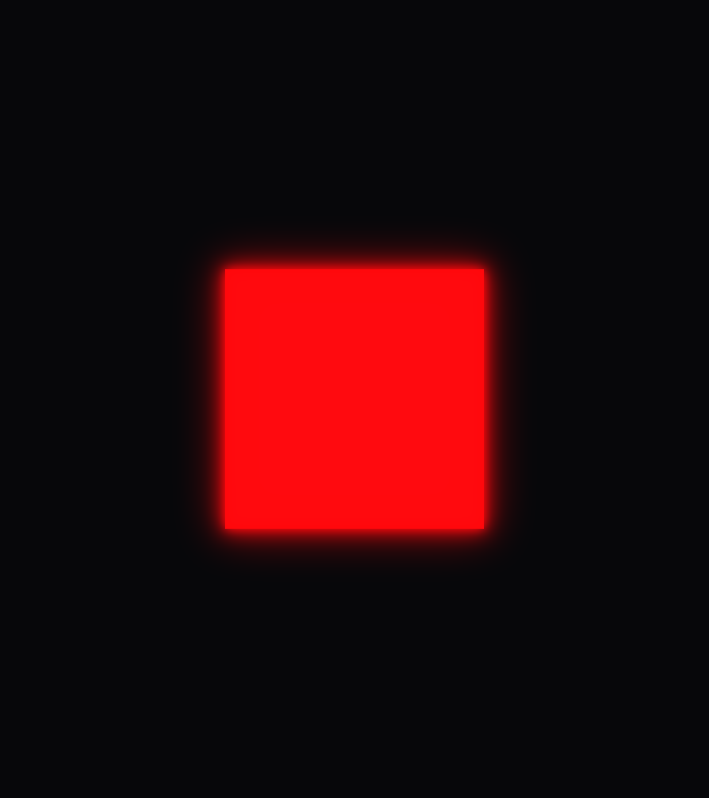
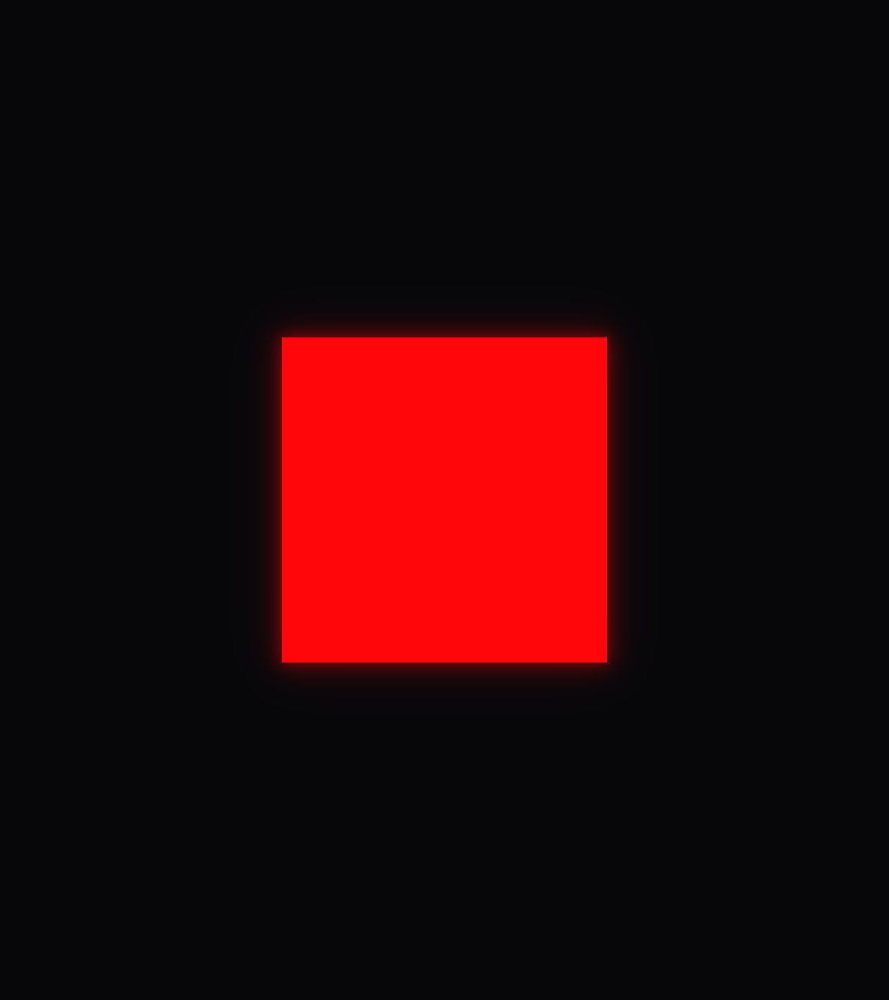
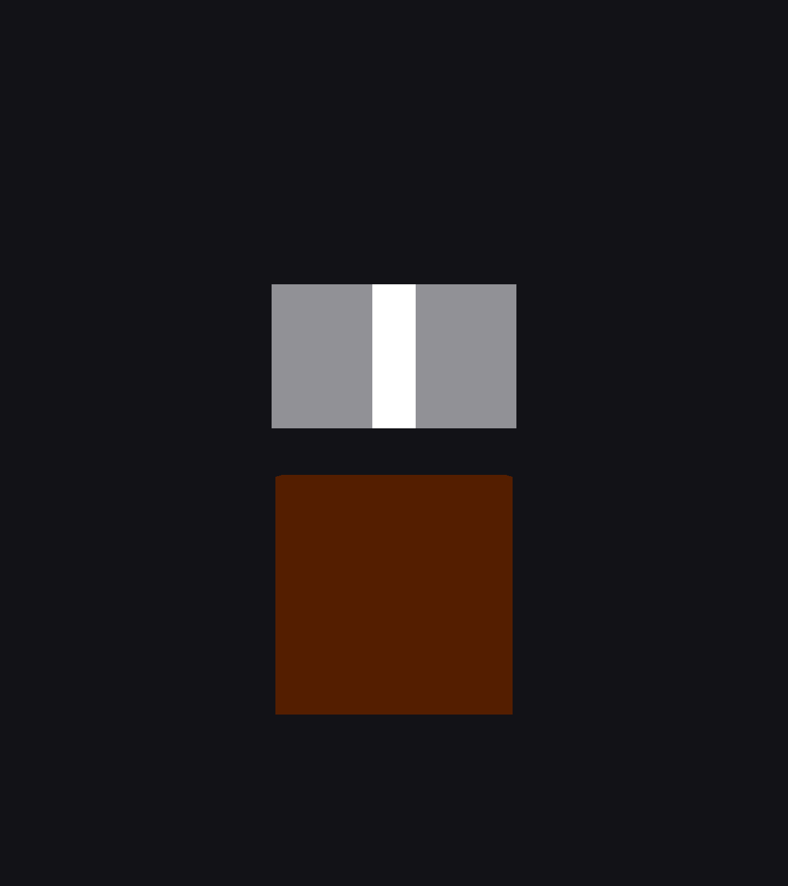
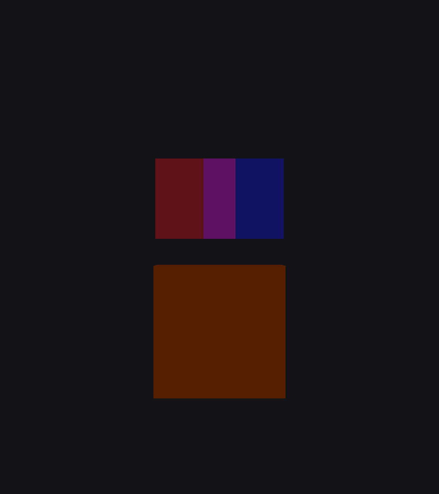
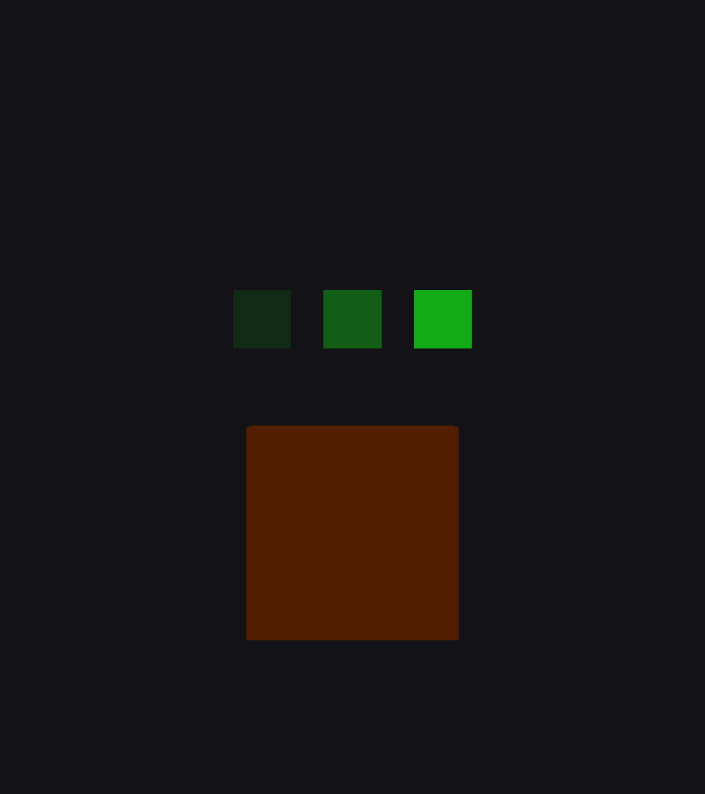

# Forward+ display-space (gamma-space) additive blending

**Status:** 🟢 Spike 3 complete — material-facing `render_mode display_additive` works end-to-end (routing + post-tonemap draw + gamma add + occlusion, no crashes). One known bug: static-scene temporal accumulation. Remaining: fix accumulation, color-space encode, multiview/scaling.
**Branch:** `spike/forward-plus-display-space-additive`
**Owner:** Aaron Curry
**Last updated:** 2026-07-21

> Living document. Update the Status line and the Change log at the bottom as this
> progresses. This is engine-side R&D toward a first-class Forward+ display-space
> additive path so downstream projects don't need the CompositorEffect workaround.

---

## The one-sentence ask

Give Forward+ a way to perform **additive (and subtractive) blending of transparent
materials in display/gamma space** — where the blend arithmetic happens on tonemapped,
display-encoded values that **clamp at 1.0** — instead of today's behavior, where
`blend_add`/`blend_sub` accumulate in the **linear HDR float buffer before tonemapping**
(unclamped, wrong color space for a PSX-faithful look).

## Two axes — do not conflate them

1. **Blend *equation*** (the math): mix / add / sub / mul / reverse-subtract, custom
   factors. Covered by godot-proposals **#7058** and PR **#102366**. Not our problem —
   `blend_add` already exists.
2. **Blend *color space*** (where in the pipeline the add happens): linear-HDR vs
   display/gamma. **This is the ask.** No existing proposal frames the problem this way.

---

## Assessment (verified against 4.x source)

Every load-bearing claim in the original handoff checks out against the tree:

| Claim | Evidence |
|---|---|
| Forward+ color buffer is float, never clamps | `_render_buffers_get_preferred_color_format()` returns `R16G16B16A16_SFLOAT` — `renderer_scene_render_rd.cpp:1166` |
| `blend_add` is a HW blend in that buffer | `BLEND_OP_ADD`, `src=SRC_ALPHA`, `dst=ONE` — `material_storage.cpp:664` |
| Tonemap runs *after* the transparent pass | alpha pass → resolve → post FX → `tone_mapper->tonemapper(...)` — `renderer_scene_render_rd.cpp:~2549` |
| No post-tonemap geometry hook exists | pipeline order: opaque → `RENDER_LIST_ALPHA` (back-to-front) → resolve → post → tonemap → SMAA |
| Mobile clamps "for free" | Mobile tonemaps in-shader and writes a UNORM (display-encoded) attachment, so its HW additive blend saturates at 1.0 |

**Conclusion:** blend space is an *emergent consequence of the attachment format*, never
an exposed knob. We want it to become a knob.

### The three candidate shapes

| # | Shape | Verdict |
|---|---|---|
| 1 | Route flagged transparents into a **display-encoded attachment**, blend after tonemap, composite | ✅ **Recommended.** Faithful; true replica of Mobile. Real risks: RD pipelines are keyed to framebuffer format (scene pipelines must recompile for the target) + depth-attachment story for a 2nd geometry pass. |
| 2 | Post-tonemap **CompositorEffect** callback stage | ⚠️ Basically the game's current workaround promoted into the engine — a screen-space effect, not first-class geometry blending. Lowest risk, least faithful. |
| 3 | In-shader `blend_add_display` **render_mode** (tonemap→blend→store) | ❌ **Trap.** HW blend reads `dst` from the float attachment and adds in linear regardless of shader math. Can't clamp against a display-space `dst` you can't read without framebuffer-fetch (no portable HW path: Metal ROG / D3D12 ROV / Vulkan interlock). Not viable as stated. |

---

## Spike log

### Spike 1 — mechanism proof (2026-07-21) ✅

**Goal:** prove the color-space *clamp* mechanism cheaply — does the attachment format
alone decide whether additive saturates in Forward+?

**Change (1 functional line):** `renderer_scene_render_rd.cpp:1166`
`R16G16B16A16_SFLOAT` → `R16G16B16A16_UNORM`.

> ⚠️ First attempt edited `RenderSceneBuffersRD::get_base_data_format()`'s `force_hdr`
> branch — **dead code** for the default config. `force_hdr` only fires with viewport
> "HDR 2D" enabled (off by default); otherwise the buffer uses `preferred_data_format`,
> which is set from `_render_buffers_get_preferred_color_format()`. That function is the
> real knob. Noted for shape #1 plumbing.

**Test:** 5 overlapping `blend_add` quads, flat red `(0.4,0,0)` each → linear sum ≈ 2.0.
Glow on, `glow_hdr_threshold = 1.0`, filmic tonemap. Forward+, RTX 5090.
Project: `/tmp/spike-additive/proj` (not committed; regenerate from the snippet below).

**Result — A/B (same scene, only the format differs):**

| Baseline (float `SFLOAT`) | Spike (`UNORM`) |
|---|---|
|  |  |
| Large, luminous bloom halo — 2.0 survives in the buffer, feeds glow hard | Tight, starved halo — HW blend clamped each channel at 1.0 in the attachment |

**Proven:** in Forward+, the color-attachment format alone governs whether additive
saturates at white or accumulates unbounded in linear HDR. This is the "free clamp"
Mobile gets, confirmed on real hardware.

**Explicitly NOT proven / not shippable:**
- This is the **clamp** mechanism, not true gamma-space PSX add. Forward+ still tonemaps
  downstream, so the add stays **linear-space**, just clamped at 1.0.
- Flipping the *global* format caps HDR range for glow/tonemap engine-wide — throwaway.
- Faithful gamma-space add still needs **shape #1** (blend flagged transparents into a
  **post-tonemap display-encoded** target).

### Spike 2 — gamma-space add end-to-end (2026-07-21) ✅

**Goal:** prove *true* gamma-space additive (not just clamp) via a hand-wired
post-tonemap geometry pass, and de-risk the two shape-#1 unknowns (pipeline format
key, depth attachment) before building any material-facing API.

**What was built** (self-contained `DisplaySpaceAdditive` effect, ~1 shader + 1 class):
- New GLSL effect shader `shaders/effects/display_space_additive.glsl` — draws
  world-space quads, emits display-space color directly (no tonemap, no sRGB encode).
- New effect `effects/display_space_additive.{h,cpp}` — owns its pipeline; blend =
  `BLEND_OP_ADD` (src=ONE, dst=ONE); depth-stencil = test on, **write off**,
  `COMPARE_OP_GREATER_OR_EQUAL`. Draws a fixed set of test quads.
- Wired into `render_forward_clustered.cpp` right after
  `_render_buffers_post_process_and_tonemap()`: builds a framebuffer from
  `[render_target_get_rd_texture()` (UNORM) + `get_depth_texture()]` and draws.
  Guarded to the simple case (single view, internal size == target size).

**Key facts nailed down:**
- The post-tonemap render target is **`R8G8B8A8_UNORM` (not `_SRGB`)** — the tonemap
  shader writes sRGB-*encoded* values into a plain UNORM buffer. So `BLEND_OP_ADD` there
  adds gamma-encoded values and clamps at 1.0 = **true gamma-space add**. (An `_SRGB`
  attachment would blend in *linear* per the Vulkan spec — the opposite of what we want.)
- The MVP must bake Godot's depth-correction: `correction * cam_projection * view`, where
  `Projection::set_depth_correction(true)` applies the **Y-flip + reverse-Z remap** the
  scene depth buffer was written with. Without it: two bugs surfaced in order — (1) a raw
  `projection*view` renders upside-down (Vulkan NDC +Y is down); (2) even after a manual
  Y-flip, occlusion failed because the *depth* wasn't reverse-Z-remapped. `set_depth_correction`
  fixes both at once. Mirrors `RenderSceneDataRD::get_*_projection`.
- **Pipeline format key is a non-issue for a dedicated shader:** `PipelineCacheRD` compiles
  the variant for the `[display color + depth]` framebuffer format lazily on first draw. No
  scene-material-variant surgery needed. (A *material-facing* API would still need scene
  shaders compiled for the display framebuffer — but the mechanism itself is proven.)

**Result (single frame, Forward+, RTX 5090):**



- Two 0.5-gray additive quads overlap into a **pure white** strip (0.5 + 0.5 = 1.0 in
  gamma; a linear add would give a muddy ~0.68 gray). Wings stay gray. → **gamma-space add**.
- The strip **saturates at white**, doesn't run away. → **clamp at 1.0**.
- A cyan quad parked *behind* an opaque wall is **fully occluded**. → **depth-test against
  the opaque scene works** post-tonemap.

**Proven:** a post-tonemap geometry pass into the UNORM render target with HW additive
blend + scene-depth test gives faithful gamma-space additive **with correct occlusion** in
Forward+. This is shape #1's engine mechanism, minus the material API.

**Still not a feature:** quads/colors are hardcoded in the effect; there's no `render_mode`,
no material routing, no multiview/upscaling support, and it always runs. Next step is the
material-facing API.

### Spike 3 — material-facing `render_mode display_additive` (2026-07-21) 🟢 works, 1 known bug

**Goal:** expose the proven mechanism to real materials. Add a spatial-shader render_mode,
route flagged instances into a new render list, and draw that list through the *actual
forward material pipeline* post-tonemap.

**What was wired (7 sites, all in-tree — no new files):**
- `shader_types.cpp` — register `display_additive` as a valid spatial render_mode.
- `scene_shader_forward_clustered.{h,cpp}` — new `bool display_additive` on ShaderData, set
  from `actions.render_mode_flags["display_additive"]`.
- `render_forward_clustered.h` — new `RENDER_LIST_DISPLAY_ADDITIVE` list (+ instance buffer).
- `render_forward_clustered.cpp` `_fill_render_list` — instances whose shader has
  `display_additive` go to the new list instead of `RENDER_LIST_ALPHA`; plus sort +
  `_fill_instance_data` for it.
- `render_forward_clustered.cpp` `_render_scene` — build the list's render-pass uniform set
  while buffers are valid (bindings reference pooled, frame-lived textures, so it survives
  tonemap), then after `_render_buffers_post_process_and_tonemap` draw the list into
  `[RT UNORM color + scene depth]` via the normal `_render_list_with_draw_list`.

The scene shader's own corrected-projection UBO handles Y-flip + reverse-Z, so no manual MVP
correction is needed (unlike the Spike 2 dedicated shader). The Spike 2 `DisplaySpaceAdditive`
effect is left in place but is no longer called.

**Result (real `ShaderMaterial`, `render_mode display_additive, blend_add, unshaded`):**

| Overlap + occlusion (frame 2) | Magnitude ramp 0.1 / 0.3 / 0.6 (frame 2) |
|---|---|
|  |  |
| Red wing / magenta overlap / blue wing → additive works via real materials; cyan quad occluded by the wall | Monotonic additive brightness → per-frame magnitude is value-correct |

**Proven:** routing + post-tonemap draw through the real material pipeline works with **no RD
validation errors / crashes**; additive is gamma-space, depth occlusion is correct, and
per-frame output is value-correct.

**⚠️ Known bug — static-scene temporal accumulation.** On a perfectly static scene the additive
contribution stacks across frames (green 0.1 / 0.3 / 0.6 all saturate identically by frame 12),
i.e. value-independent runaway. A *moving* quad does **not** smear and dynamic scenes look fine,
so it's a render-target refresh/lifecycle interaction: on static frames the RT isn't being
re-established from tonemap before the pass adds again. Root cause needs a RenderDoc capture;
must be fixed before this is usable.

---

## Recommended next step — finish shape #1

- [x] ~~Material seam / render_mode / new render list~~ — done in Spike 3 (`display_additive`).
- [x] ~~Scene-shader variants for the display framebuffer~~ — non-issue: `_render_list_with_draw_list`
      into the `[UNORM + depth]` framebuffer compiles the needed pipeline variant lazily; no new
      `COLOR_PASS_FLAG_*` required.
- [x] ~~Depth attachment / occlusion~~ — works via `[RT color + get_depth_texture()]`.
- [ ] **Fix temporal accumulation (blocker).** Ensure the pass composites onto a freshly
      tonemapped RT each frame. RenderDoc a static frame; check whether tonemap actually
      overwrites `rt->color` and whether the pass runs once per tonemap output.
- [ ] **Color-space fidelity.** The material currently emits *linear* albedo into the gamma
      buffer (visually close, clamps fine, but not exact PSX gamma add). For faithful gamma-space
      add, sRGB-encode the material output — a specialization/`#define` in the scene shader that
      wraps `frag_color.rgb` in `linear_to_srgb` for the display-additive variant.
- [ ] **Multiview / upscaling / MSAA.** Still guarded out (single view, internal==target size).
      Handle XR (per-view) and the scaling/SMAA path (tonemap → intermediate).
- [ ] **`blend_sub` display variant + mobile.** `blend_sub` should work by the same routing;
      the mobile renderer needs the render_mode registered (or explicitly rejected) so mobile
      shader compiles don't choke on `display_additive`.
- [ ] **Upstream framing.** No godot-proposal frames this as blend *space*. Consider filing
      one to fill that gap (distinct from #7058 / #102366 which are blend *mode*).

## Reproduce Spike 1 (mechanism proof)

Spike 2 lives in the engine source on this branch (build + run any Forward+ scene, single
view, no upscaling; the hardcoded quads draw automatically). The snippet below reproduces
Spike 1's global-flip A/B instead.

```gdscript
# main.gd — attach to a Node3D main scene, Forward+ renderer.
extends Node3D
const SHADER := preload("res://add.gdshader")  # blend_add, unshaded; ALBEDO = add_color
func _ready():
    var cam := Camera3D.new(); cam.position = Vector3(0,0,4); add_child(cam); cam.make_current()
    var env := Environment.new()
    env.background_mode = Environment.BG_COLOR; env.background_color = Color(0.02,0.02,0.03)
    env.tonemap_mode = Environment.TONE_MAPPER_FILMIC
    env.glow_enabled = true; env.glow_hdr_threshold = 1.0
    var we := WorldEnvironment.new(); we.environment = env; add_child(we)
    var mat := ShaderMaterial.new(); mat.shader = SHADER
    mat.set_shader_parameter("add_color", Vector3(0.4, 0.0, 0.0))
    for i in range(5):
        var q := MeshInstance3D.new(); var m := QuadMesh.new(); m.size = Vector2(2,2)
        q.mesh = m; q.material_override = mat; q.position = Vector3(0,0,-i*0.01); add_child(q)
```

Build: `scons platform=linuxbsd target=editor dev_build=yes -jN` (~3 min on this machine).

## Reference material

- godot-proposals **#7058** — custom blend equation (`blend_custom`); blend *mode*, not space.
- godot **#102366** (PR) — "Blend Factor Specification in Shaders"; blend *mode*.
- godot-proposals **#13115** — after-glow/before-tonemap CompositorEffect hook (still pre-tonemap).
- godot-proposals **#7916** — RenderingCompositor (per-pass custom buffers in materials).
- godot-proposals **#2621 / #14344 / #12552** — related blend-mode requests.
- Docs: `tutorials/rendering/compositor.html`, `shader_reference/spatial_shader.rst`.

## Change log

- **2026-07-21** — Initial assessment + Spike 1 (mechanism proof, UNORM attachment). Clamp
  mechanism proven; shape #1 recommended for the real feature.
- **2026-07-21** — Spike 2: hand-wired post-tonemap `DisplaySpaceAdditive` pass. Proved true
  gamma-space add + clamp + depth occlusion in Forward+ (Spike 1's global flip reverted).
  Both shape-#1 rendering unknowns (pipeline format key, depth attachment) de-risked; the
  remaining work is the material-facing API. Files: `shaders/effects/display_space_additive.glsl`,
  `effects/display_space_additive.{h,cpp}`, wired in `render_forward_clustered.cpp` +
  `renderer_scene_render_rd.{h,cpp}`.
- **2026-07-21** — Spike 3: material-facing `render_mode display_additive`. Real materials route
  into a new `RENDER_LIST_DISPLAY_ADDITIVE` drawn post-tonemap through the actual forward
  pipeline; gamma add + occlusion work, no crashes. Known bug: static-scene temporal
  accumulation (dynamic scenes fine). Files: `shader_types.cpp`,
  `scene_shader_forward_clustered.{h,cpp}`, `render_forward_clustered.{h,cpp}`.
